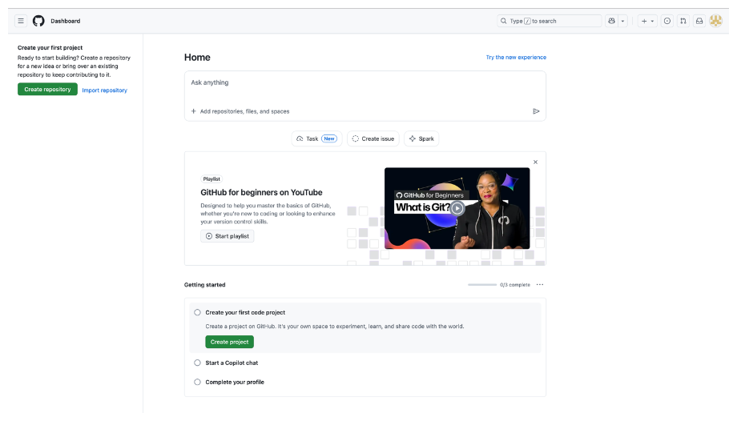
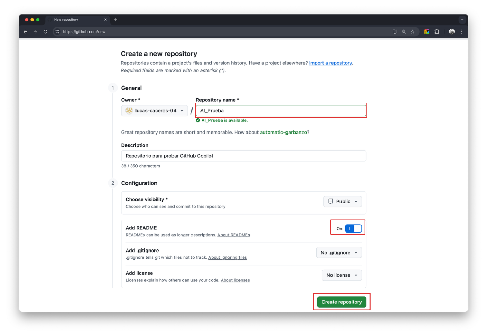
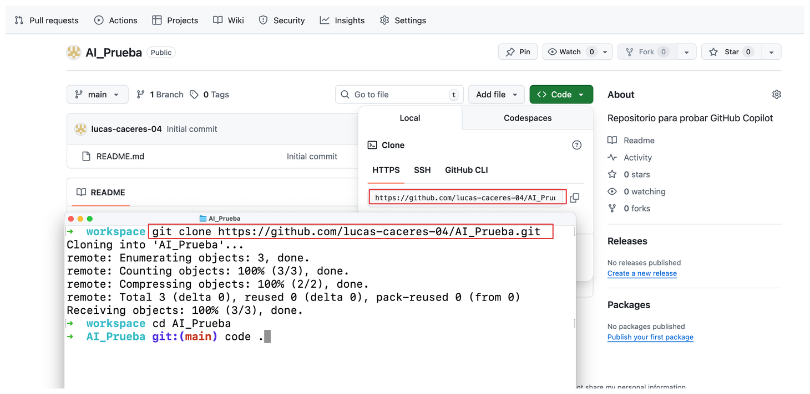
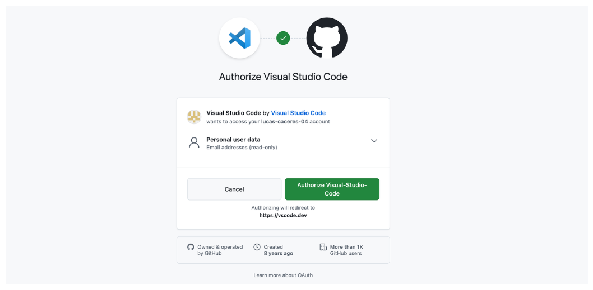
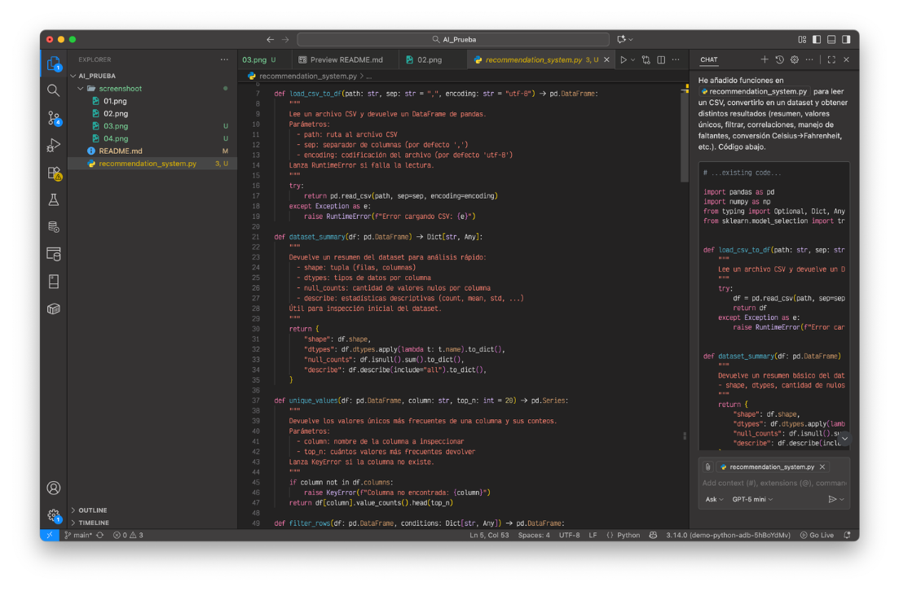
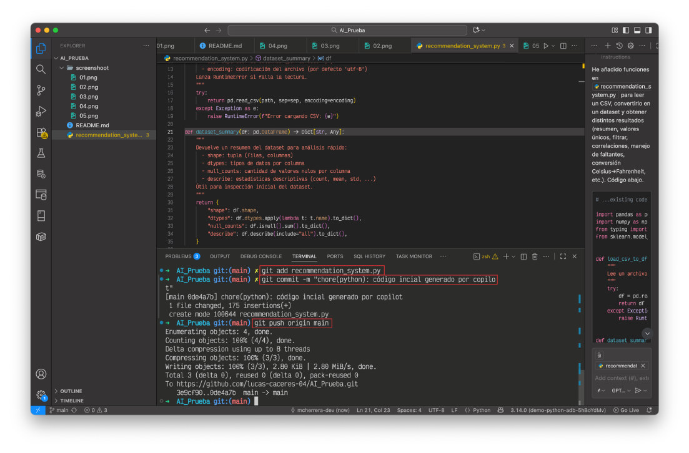

# AI_Prueba
Repositorio para probar GitHub Copilot

## Pasos realizados

### 1. Crear cuenta en GitHub

### 2. Crear un repositorio

### 3. Clonar el repositorio

### 4. Habilitar GitHub Copilot

### 5. Generar código inicial con la IA de GitHub Copilot

### 6. Subir los cambios a GitHub

